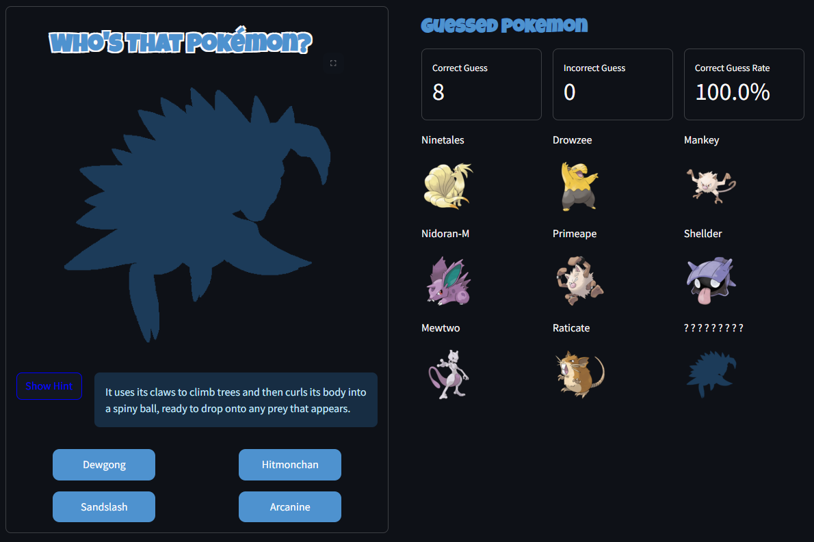

# PokeShade

A fun "Who's That Pokémon?" guessing game built with Streamlit.  
Players are shown a masked silhouette of a random Pokémon and must guess its name. Hints are available, and the game keeps track of Pokémon already shown in the session.

## Try It Here

**[PokeShade](https://poke-shade.streamlit.app/)**

|  |  |
| :------------------------------------------: | :------------------------------------------: |

## Features

- Randomly selects a Pokémon from the first 151 (Kanto region).
- Displays a masked (silhouette) image of the Pokémon.
- Option to show a hint.
- Multiple choices for answer selection.
- Reveals the answer and original image after each guess.
- Avoids repeating Pokémon in a single session.
- Display counts of correct and incorrect guess and correct guess rate.
- Display guessed Pokémon pictures.

## Project Structure

```
pokeshade/
│
├── main.py              # Streamlit UI and game logic.
├── pokemon_fetcher.py   # Fetches Pokémon data (name, image, hints) from PokéAPI.
├── image_masker.py      # Masked image from Pokémon image.
├── sample_image/        # Sample images of UI
│   ├── 1.png
│   ├── 2.png
└── README.md            # Project documentation
```

---

## How it Works

- **main.py**: Handles the Streamlit UI, user input, and game flow.
- **pokemon_fetcher.py**: Fetches Pokemon data from the PokéAPI.
- **image_masker.py**: Masks the Pokemon image to create a silhouette effect, also return the original image.

---

## Credits

- Pokémon data and images from [PokéAPI](https://pokeapi.co/).
- Built with [Streamlit](https://streamlit.io/).
